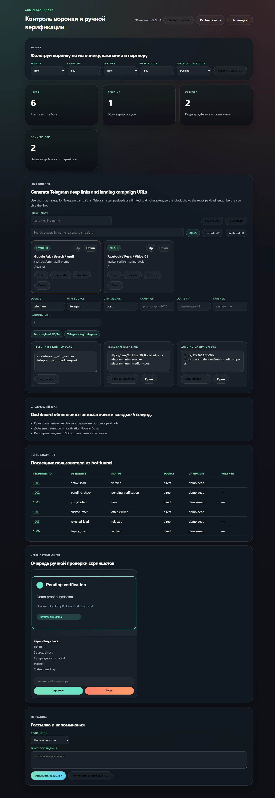
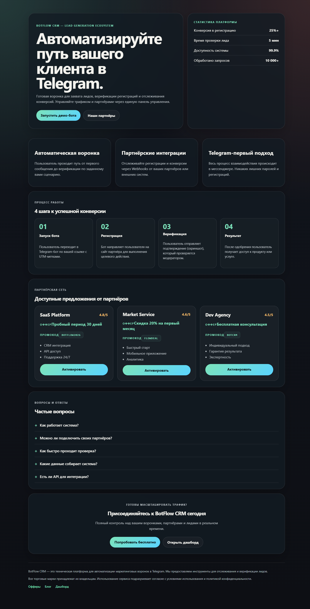
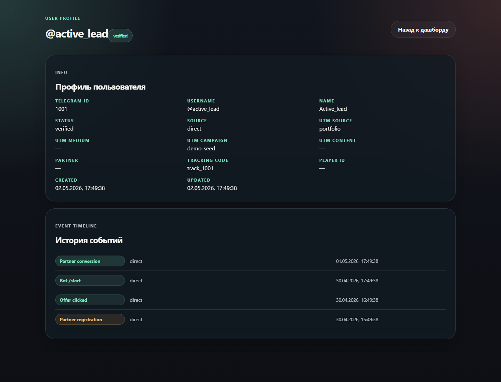
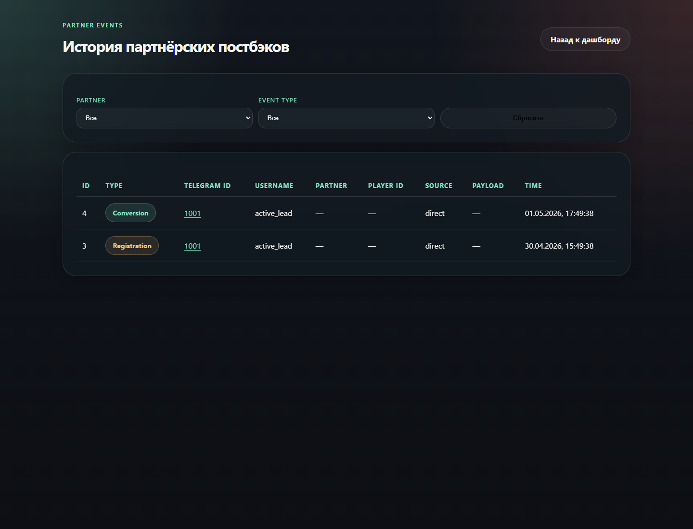
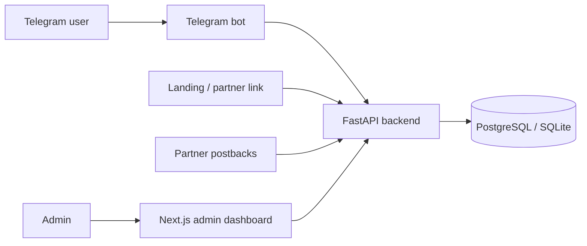

# BotFlow CRM

Production-ready Telegram CRM funnel for lead generation, verification, partner tracking, and campaign analytics.

BotFlow CRM is a portfolio project that demonstrates how a Telegram-first business can move a user from the first bot click to a verified conversion while keeping the whole funnel visible in an admin dashboard.

## What It Does

- Captures leads from a Telegram bot and stores attribution data from start payloads, UTM tags, and partner links.
- Tracks funnel events such as bot start, offer click, verification submission, partner registration, and conversion.
- Gives admins a dashboard for live funnel metrics, user profiles, verification review, campaign presets, and broadcasts.
- Accepts partner webhooks for external registration and conversion postbacks.
- Includes a realistic demo seed so recruiters can explore the product locally without real Telegram or partner credentials.

## Why This Project Matters

This is not a simple landing page or CRUD demo. BotFlow CRM is a small production-style automation system with a bot, backend API, database migrations, webhook compatibility, a Next.js dashboard, local demo data, and automated tests.

It shows practical fullstack automation skills:

- backend service design with FastAPI and async SQLAlchemy;
- Telegram bot flows with aiogram;
- conversion tracking and attribution logic;
- admin-facing analytics UI with Next.js and TypeScript;
- Alembic migrations and Docker-ready infrastructure;
- automated tests for parsing, tracking, and statistics logic.

## Screenshots

### Dashboard Overview



### Landing Page



### User Detail



### Partner Events



## Tech Stack

| Layer | Technology |
| --- | --- |
| Bot | Python, aiogram 3 |
| Backend API | FastAPI, async SQLAlchemy |
| Database | PostgreSQL in Docker, SQLite fallback for local demo |
| Migrations | Alembic |
| Frontend | Next.js, TypeScript, React |
| Infrastructure | Docker Compose, PowerShell dev scripts |
| Testing | pytest, pytest-asyncio |

## Architecture



## Core Flow

1. A user opens the Telegram bot through a tracked campaign link.
2. The bot saves source, UTM data, partner slug, and tracking code.
3. The user clicks an offer or submits verification proof.
4. The backend stores funnel events and verification submissions.
5. Admins review users, approve or reject submissions, and monitor conversion stats.
6. Partner webhooks can mark external registrations and conversions.

## Demo Mode

You can explore BotFlow CRM in a few minutes with local demo data.

```bash
npm install
npm run dev:start
npm run demo:seed
```

Then open:

```text
http://localhost:3000/dashboard
```

Use the `ADMIN_API_KEY` from your `.env` file when the dashboard asks for an admin key.

The demo seed creates:

- 6 demo users in different funnel states;
- conversion and legacy compatibility events;
- pending and rejected verification submissions;
- sample campaign presets.

The seed is idempotent, so running `npm run demo:seed` multiple times is safe.

For a guided walkthrough, see [docs/DEMO_SCRIPT.md](docs/DEMO_SCRIPT.md).

## Local Setup

1. Copy environment variables:

```bash
copy .env.example .env
```

2. Install Node dependencies:

```bash
npm install
```

3. Create the backend virtual environment:

```bash
cd apps/bot-api
python -m venv .venv
.venv\Scripts\activate
pip install -e .
cd ..\..
```

4. Start the local stack:

```bash
npm run dev:start
```

The dev script runs Alembic migrations automatically. If local PostgreSQL is unavailable, it falls back to SQLite runtime storage for the demo.

## Useful Commands

| Command | Purpose |
| --- | --- |
| `npm run dev:start` | Start backend, bot, web app, and migrations |
| `npm run dev:status` | Show local service status |
| `npm run dev:stop` | Stop local services |
| `npm run demo:seed` | Populate demo users and funnel events |
| `npm run test:backend` | Run backend tests |
| `npm run build:web` | Build the Next.js app |
| `npm run db:migrate` | Apply Alembic migrations |
| `npm run docker:up` | Start Docker infrastructure |

## API Surface

Main backend endpoints:

- `GET /health`
- `GET /api/admin/stats/overview`
- `GET /api/admin/users`
- `GET /api/admin/campaign-presets`
- `POST /api/admin/campaign-presets`
- `POST /api/admin/send-reminders`
- `POST /api/admin/broadcast`
- `POST /api/webhooks/partner/registered`
- `POST /api/webhooks/partner/converted`

Admin endpoints require the `X-API-Key` header.

The legacy endpoint `POST /api/webhooks/partner/deposited` is intentionally kept as a deprecated compatibility alias and maps to the neutral conversion event.

## Verification Flow

- The user submits proof through the Telegram bot.
- The backend stores metadata and the local file path.
- The dashboard shows the submission in the verification queue.
- An admin can approve or reject it.
- The decision is stored as a funnel event and reflected in user status.

## Testing And Build Status

Current verified checks:

```bash
npm run test:backend
npm run demo:seed
npm run build:web
```

Expected result:

- backend tests pass;
- demo seed can be run repeatedly;
- web build completes without external font network dependencies.

## Portfolio Notes

This project is designed to be presented as a fullstack automation case study:

- problem: teams need a reliable way to track Telegram leads and partner conversions;
- solution: bot-driven CRM funnel with dashboard analytics and webhook integrations;
- business value: less manual tracking, clearer attribution, faster verification, and demo-ready reporting.

See [docs/CASE_STUDY.md](docs/CASE_STUDY.md) for a recruiter-friendly project breakdown, [docs/DEMO_SCRIPT.md](docs/DEMO_SCRIPT.md) for a 5-minute walkthrough, [docs/ARCHITECTURE_NOTES.md](docs/ARCHITECTURE_NOTES.md) for design decisions, [docs/RELEASE_NOTES_V1.md](docs/RELEASE_NOTES_V1.md) for the v1.0.0 release summary, and [docs/PORTFOLIO_COPY.md](docs/PORTFOLIO_COPY.md) for ready-to-use resume, LinkedIn, HH, and interview copy.
