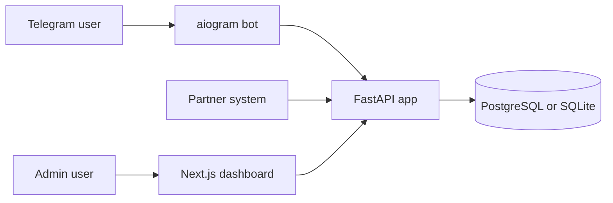

# BotFlow CRM Architecture Notes

These notes explain the main design decisions behind BotFlow CRM.

## System Boundary

BotFlow CRM is a small production-style lead funnel. It owns:

- Telegram onboarding and verification collection;
- user, event, campaign, and verification data;
- admin APIs for dashboard operations;
- partner webhook ingestion;
- local demo data for portfolio review.

It does not try to own payment processing, partner-side identity, or external CRM synchronization. Those would be separate integrations around the core funnel.

## High-Level Architecture



## Backend Decisions

### FastAPI

FastAPI is used because the project needs a clear HTTP API surface, request validation, async handlers, and simple OpenAPI-friendly structure. It fits webhook ingestion and dashboard APIs well.

### Async SQLAlchemy

Async SQLAlchemy keeps database access aligned with the async FastAPI and aiogram runtime. The project separates models, schemas, and services so the domain logic is easier to test.

### Alembic

Alembic migrations make the schema explicit and repeatable. This matters for a portfolio project because reviewers can see that the database is not an afterthought.

### Service Layer

The backend keeps core user and campaign logic in service modules rather than placing everything directly inside route handlers. This makes parsing, tracking, stats, and event creation testable without needing a full HTTP flow.

## Bot Decisions

### aiogram 3

aiogram is used for Telegram automation because it supports async bot flows and clean handler organization.

The bot is responsible for:

- capturing Telegram users;
- parsing start payloads;
- storing campaign attribution;
- sending partner links;
- collecting verification proof;
- notifying users about status changes.

The bot does not calculate dashboard analytics directly. That responsibility stays in backend services.

## Frontend Decisions

### Next.js

Next.js is used for the admin dashboard and landing page. The dashboard is the reviewer-facing surface for:

- funnel metrics;
- user profiles;
- partner events;
- campaign presets;
- broadcasts and reminders.

### API Proxy Routes

Frontend API routes proxy admin dashboard requests to the backend using environment variables. This keeps the browser-facing code simple and avoids hardcoding backend URLs in components.

### System Fonts

The UI uses a system font stack instead of remote Google Fonts. This keeps builds network-independent and avoids external font requests during local review.

## Data Model

The core data model is built around:

- users;
- funnel events;
- verification submissions;
- campaign presets.

Events are the audit trail of the funnel. They allow the dashboard to explain not just the current user state, but how the user reached that state.

## Partner Webhooks

The neutral production endpoint is:

```text
POST /api/webhooks/partner/converted
```

The project also keeps this deprecated compatibility alias:

```text
POST /api/webhooks/partner/deposited
```

The alias maps to the same neutral conversion event. This is intentional: real systems often need to support old partner postbacks while moving to better product terminology.

## Demo Mode

The demo seed creates realistic local data without external Telegram or partner credentials.

Design goals:

- make the dashboard useful immediately after setup;
- keep seeding idempotent;
- include several user states;
- include both current and legacy conversion-style events;
- allow recruiters to explore the product without private tokens.

## Reliability And Verification

The project includes tests for:

- start payload parsing;
- partner slug and tracking code behavior;
- event marking by Telegram ID and tracking code;
- overview stats, including legacy conversion compatibility.

The expected release checks are:

```bash
npm run test:backend
npm run demo:seed
npm run build:web
```

## Security Notes

- Secrets are stored in `.env`, not committed.
- `.env.example` documents required variables with safe placeholder values.
- Admin endpoints require an API key.
- Runtime databases, uploads, logs, virtual environments, build output, and local assistant folders are ignored.

## Tradeoffs

- The local demo can fall back to SQLite to reduce setup friction.
- PostgreSQL remains the production-style database target through Docker Compose.
- The dashboard is intentionally focused on operations, not marketing visuals.
- The project favors a complete end-to-end workflow over a larger set of shallow features.

## Future Extensions

Good next extensions would be:

- role-based admin access;
- webhook signature verification;
- audit log filters and export;
- CI workflow for tests and web build;
- deployed demo environment with sanitized data;
- richer campaign analytics by source and UTM.

These should be added only after the current release remains easy to run and explain.
