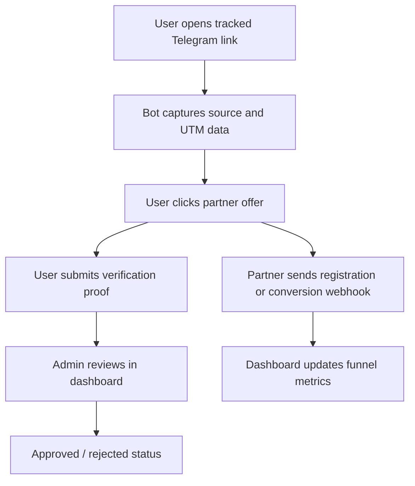

# BotFlow CRM Case Study

## One-Line Summary

BotFlow CRM is a Telegram-first lead generation platform that tracks users from bot entry to verified conversion and gives admins a dashboard for attribution, verification, and funnel analytics.

## Problem

Many Telegram-based acquisition funnels are hard to manage once traffic comes from multiple campaigns, partners, and user states. Teams often lose visibility into:

- where each user came from;
- whether the user clicked the offer;
- whether verification is pending, approved, or rejected;
- which partner postback belongs to which user;
- how many leads actually became conversions.

## Solution

BotFlow CRM connects four pieces into one workflow:

- a Telegram bot for onboarding and proof submission;
- a FastAPI backend for events, users, webhooks, and admin APIs;
- a database layer with migrations and demo data;
- a Next.js dashboard for analytics and operations.

The system turns a messy manual funnel into a traceable flow where every user has attribution, status, events, and verification history.

## User Journey

## Key Product Features

- Telegram onboarding with campaign attribution.
- UTM and partner slug parsing from bot start payloads.
- Partner tracking code generation.
- Admin dashboard with users, stats, verification queue, and event timeline.
- Partner webhooks for registration and conversion events.
- Deprecated legacy webhook alias for backward compatibility.
- Demo seed with realistic local data.
- Automated backend tests for critical funnel logic.

## Engineering Highlights

### Production-Like Backend

The backend is built with FastAPI and async SQLAlchemy. It separates models, schemas, handlers, and service logic, making the funnel easier to test and evolve.

### Telegram Automation

The bot handles onboarding, offer routing, verification proof collection, and user-facing status messages. It turns Telegram into the main acquisition interface.

### Attribution And Tracking

The project parses start payloads, stores UTM data, generates partner tracking codes, and connects webhook postbacks back to the correct user.

### Dashboard For Operations

The Next.js dashboard gives admins a practical view of users, conversion events, campaign presets, verification requests, and broadcasts.

### Demo-Ready Portfolio Experience

The seed script creates a realistic local dataset, so a recruiter or reviewer can explore the dashboard without real Telegram tokens, partner APIs, or production data.

### Reliability Work

The project includes Alembic migrations, backend tests, idempotent demo seeding, a network-independent web build, and Docker-ready infrastructure.

## Tech Stack

| Area | Tools |
| --- | --- |
| Bot | Python, aiogram 3 |
| API | FastAPI, async SQLAlchemy |
| Database | PostgreSQL, SQLite demo fallback |
| Migrations | Alembic |
| Frontend | Next.js, TypeScript, React |
| DevOps | Docker Compose, PowerShell scripts |
| Tests | pytest, pytest-asyncio |

## What I Would Show In An Interview

1. Start the local stack with `npm run dev:start`.
2. Seed demo data with `npm run demo:seed`.
3. Open `/dashboard` and explain the funnel metrics.
4. Open a user profile and show the event timeline.
5. Show partner webhook compatibility and conversion tracking.
6. Run `npm run test:backend` and `npm run build:web`.

## Resume Bullet

Built a production-ready Telegram CRM automation platform with FastAPI, Next.js, async SQLAlchemy, aiogram, Alembic migrations, partner webhooks, idempotent demo seeding, and automated backend tests.

## Business Value

BotFlow CRM reduces manual lead tracking and gives a team a single place to understand traffic sources, verification status, partner events, and conversion performance.

For a portfolio, it demonstrates the ability to build an automation product that has a real workflow, clear domain logic, operational UI, and production-style engineering practices.
